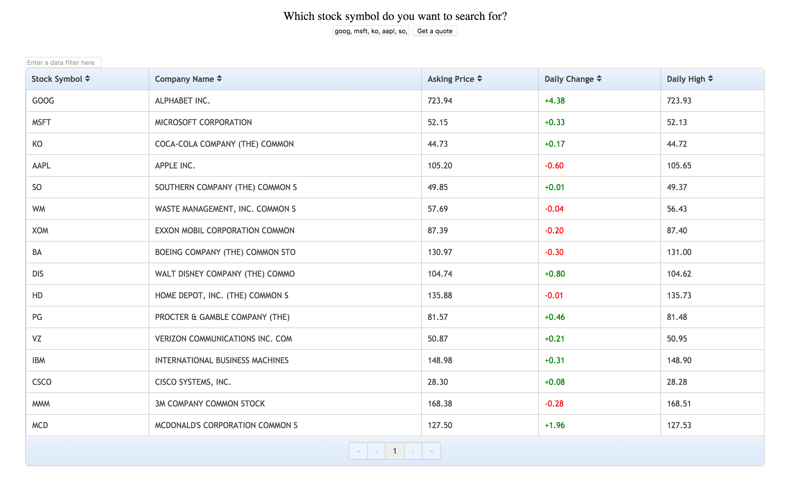

<<<<<<< HEAD
README-Yahoo Finance API
======
**Yahoo Finance API Web Application** is a practice with API's and the .getJSON method in jQuery. Created a table using basic HTML, then used jQuery and Yahoo Finance API to upload data into the table. Also, have used the jQuery plugin "Footables" to style the table and add sorting techniques. 
## Available Templates


=======
#Stock Ticker App using Yahoo Finance API and FooTables
###First experience using an API and AJAX
###Go GET JSON! 
###GET it?
```js
.getJSON();
```
###AJAX is cool btw. Just sayin.

>>>>>>> origin/master
